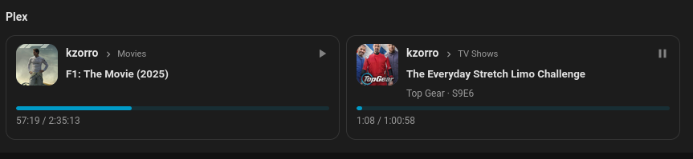

# Plex Server Sessions

A HACS-installable Lovelace card for compact Plex session visibility in Home Assistant.

The card automatically discovers Plex `media_player` entities, shows active sessions by username, renders artwork when available, displays playback state, and exposes richer episode metadata and progress for currently playing media.



## Media Types

This card currently implements the Plex media types that I have real Home Assistant examples for. There are known Plex media types that I am intentionally not formatting yet.

If you run into an unsupported type, please open a GitHub issue with example Home Assistant entity data and I will happily use that to implement support for it.

## Installation

### HACS

1. Add this repository as a custom repository in HACS.
2. Select the `Dashboard` category.
3. Install `Plex Sessions Card`.
4. Add the resource exposed by HACS to your dashboard if needed.

### Manual

1. Build the project with `npm install` and `npm run build`.
2. Copy `dist/plex-server-sessions.js` into your Home Assistant `www` directory.
3. Add the resource to Lovelace.

## Example Config

Auto-discovery:

```yaml
type: custom:plex-server-sessions
title: Plex
show_inactive: false
max_columns: 4
```

Explicit entities:

```yaml
type: custom:plex-server-sessions
title: Plex
show_inactive: true
max_columns: 4
entities:
  - media_player.plex_client_service_plex_plex_web_firefox_windows
```

Contributor docs: [docs/CONTRIBUTING.md](/home/kellen/repos/plex-server-sessions/docs/CONTRIBUTING.md)
